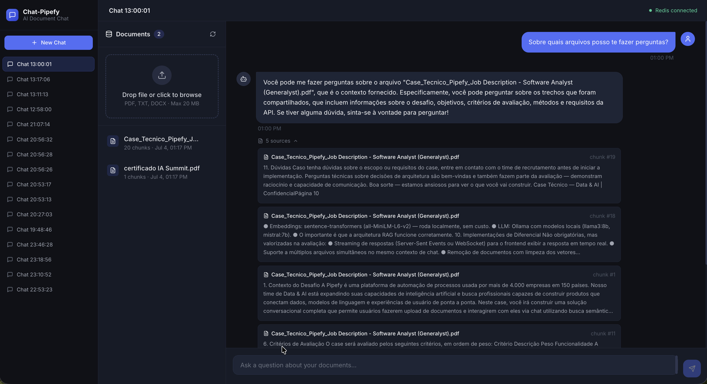
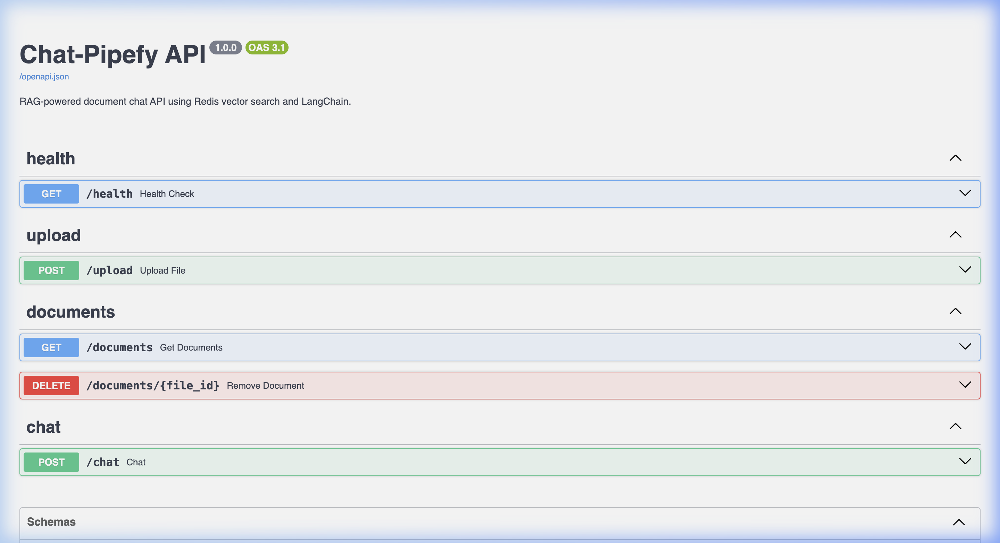
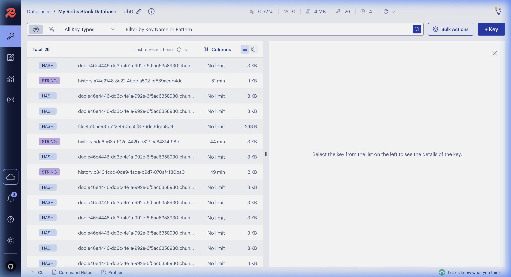
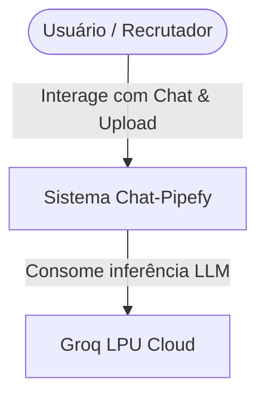
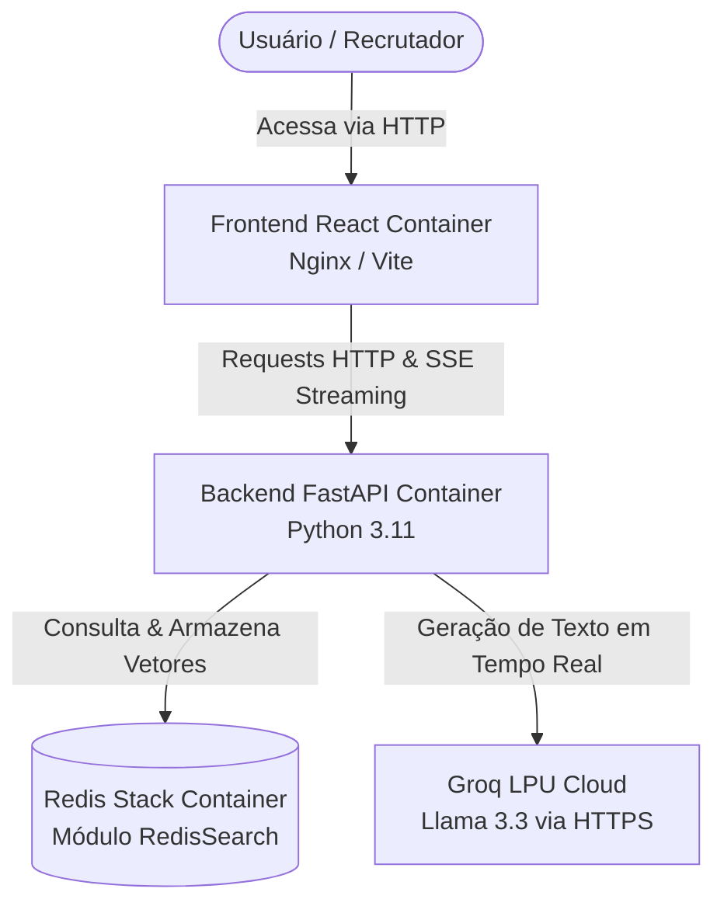

# Chat-Pipefy 🚀
> **Desafio Técnico: Data & AI Software Engineer (Pipefy)**

Um sistema completo de **Retrieval-Augmented Generation (RAG)** de alta performance que permite fazer upload de documentos e interagir com eles por chat com respostas baseadas em contexto e referências às fontes originais.

A aplicação foi projetada focando em **latência extremamente baixa**, **eficiência de custos** e **robustez arquitetural**, utilizando uma estratégia híbrida: embeddings locais combinados com processamento em nuvem ultraveloz via **Groq**.

---

## 📸 Demonstração do Projeto (Serviços)

### 1. Chat UI (Interface do Usuário)


### 2. Swagger API Docs (FastAPI Backend)


### 3. RedisInsight (Banco de Dados Vetorial)


---

## 🛠️ O que o Projeto Faz (Features de Destaque)

- **Upload Multiformato:** Suporte a arquivos `.pdf`, `.txt` e `.docx`.
- **Busca Semântica Híbrida:** Vetorização automática local e busca rápida por similaridade de cosseno usando Redis Stack.
- **Respostas por Streaming (SSE):** Respostas geradas token a token em tempo real.
- **Histórico Isolado por Sessão:** Mantém o contexto da conversa baseado em sessões ativas do usuário.
- **Rastreabilidade de Fontes:** Exibe exatamente os trechos dos documentos usados pelo modelo para formular cada resposta.
- **Gerenciamento de Documentos:** Lista dinâmica de arquivos indexados e deleção em cascata (remove o registro físico e limpa todos os vetores órfãos do Redis).

---

## 🏗️ Arquitetura do Sistema (C4 Model)

Para demonstrar a maturidade da arquitetura, o design do sistema foi modelado seguindo a metodologia **C4 Model**.

### C4 - Nível 1: Diagrama de Contexto de Sistema

Este nível descreve o escopo do sistema, quem interage com ele e suas dependências externas.



### C4 - Nível 2: Diagrama de Containers

Este nível mostra os containers de software que compõem o sistema e como eles se comunicam.



---

## 🧬 Padrão Arquitetural do Backend (MSC/REST)

O backend FastAPI foi estruturado sob o padrão **MSC (Model-Service-Controller)** para garantir o desacoplamento de responsabilidades e facilitar testes unitários.

```
┌────────────────────────────────────────────────────────┐
│                       FastAPI                          │
│                                                        │
│ 1. Controller/Routers (HTTP/REST)                      │
│    └── app/routers/chat.py                             │
│    └── app/routers/upload.py                           │
│                                                        │
│ 2. Models (Pydantic validation schemas)                │
│    └── app/models/chat.py                              │
│                                                        │
│ 3. Services (Core Business Logic)                      │
│    └── app/services/rag.py                             │
│    └── app/services/vector_store.py                    │
│    └── app/services/embeddings.py                      │
└────────────────────────────────────────────────────────┘
```

### Componentes e Responsabilidades:
1.  **Routers (Controllers):** Expõem endpoints RESTful assíncronos. Eles validam os payloads de entrada através de schemas Pydantic e delegam as regras de negócio para a camada de serviços.
2.  **Services:** Centralizam as tarefas complexas. O `ingestion.py` cuida da extração do texto, o `embeddings.py` inicializa o modelo de embeddings (local ou nuvem), o `vector_store.py` faz chamadas à API do Redis e o `rag.py` orquestra a chain de inferência.
3.  **Models:** Classes base do Pydantic que garantem tipagem estrita e validação de dados em tempo de requisição.

### Princípios RESTful Adotados:
*   **Statelessness:** Nenhuma sessão HTTP ou contexto é armazenado na memória da API. A persistência do histórico do chat é isolada no banco de dados através da variável de sessão (`session_id`) enviada pelo cliente.
*   **Interface Uniforme:** Uso correto dos métodos HTTP (`POST /upload` para indexar recursos, `DELETE /documents/{id}` para deletar síncronamente, e `GET /documents` para listagem).

---

## 🔍 Estrutura de Dados & Persistência Vetorial (NoSQL)

A modelagem de dados de vetores no Redis é do tipo **NoSQL baseada em Chave-Valor (Redis Hashes)**.

As informações extraídas de cada arquivo PDF/TXT são divididas em chunks. Cada chunk é inserido no Redis sob uma chave única seguindo o padrão `doc:{file_id}:chunk:{chunk_index}` contendo os seguintes campos:

```json
{
  "content": "Conteúdo extraído em texto plano...",
  "embedding": "Vetor binário Float32 (384 dimensões)",
  "source": "manual_colaborador.pdf",
  "file_id": "8de3229e-937e-42a6-8d63-bb487fe1ab08",
  "chunk_index": 0,
  "uploaded_at": "2026-07-04T00:12:05Z"
}
```

### Mecanismo de Remoção em Cascata
Quando o usuário aciona o endpoint `DELETE /documents/{id}`, a API realiza os seguintes passos de maneira síncrona:
1.  Executa uma query no Redis para buscar todas as chaves do prefixo `doc:{id}:*`.
2.  Remove todas as chaves encontradas simultaneamente.
3.  O indexador automático do RedisSearch atualiza o índice vetorial, impedindo que trechos do documento excluído retornem nas próximas perguntas.

---

## 🛠️ Comandos Úteis (Makefile)

O projeto inclui um `Makefile` na raiz para simplificar tarefas comuns de desenvolvimento e automação de testes:

| Comando | Descrição |
| :--- | :--- |
| `make help` | Exibe a lista de todos os comandos disponíveis no Makefile. |
| `make up` | Sobe todos os serviços via Docker Compose com build automático. |
| `make down` | Para e remove todos os containers. |
| `make build` | Reconstrói todas as imagens Docker sem iniciar os serviços. |
| `make test` | Roda todos os testes unitários com cobertura mínima de 60%. |
| `make coverage` | Gera o relatório de cobertura de código em formato HTML. |
| `make lint` | Executa o linter `flake8` e validação estática de tipos via `mypy`. |
| `make format` | Formata o código Python automaticamente com `black` e `isort`. |
| `make clean` | Remove caches, `__pycache__`, `.pytest_cache` e artefatos de build. |

---

## 🧪 Esteira de CI (GitHub Actions)

A aplicação conta com um pipeline de **CI (Integração Contínua)** configurado em `.github/workflows/ci.yml`.

### Como Funciona:
1.  **Gatilho:** Executado automaticamente a cada **Push** ou **Pull Request** direcionado à branch `main`.
2.  **Etapas do Workflow:**
    *   Sobe o container do Redis Stack como serviço dependente temporário.
    *   Instala as dependências especificadas no `requirements.txt`.
    *   Roda os formatadores (`black --check`, `isort --check`).
    *   Executa os testes unitários do backend através do `pytest` com relatório de cobertura.
    *   **Gate de Qualidade:** O build do CI falha se a cobertura de testes do backend for menor que **60%** (atualmente o projeto conta com **85%** de cobertura).

---

## 🚀 Instalação e Execução (Quick Start)

### Pré-requisitos
- [Docker](https://docs.docker.com/get-docker/) instalado.
- Uma chave de API gratuita da [Groq Cloud](https://console.groq.com/).

### 1. Clonar e Configurar
```bash
git clone https://github.com/seu-usuario/chat-pipefy.git
cd chat-pipefy

# Copiar o arquivo de exemplo de variáveis de ambiente
cp .env.example .env
```

Edite o seu arquivo `.env` recém-criado e adicione sua chave da Groq:
```env
LLM_PROVIDER=groq-hybrid
GROQ_API_KEY=gsk_suachaveaqui...
```

### 2. Inicializar os Containers
Execute o comando abaixo para construir as imagens e subir os serviços:
```bash
docker compose up --build -d
```

### 3. Acessar a Aplicação
- **Interface Gráfica (Web):** [http://localhost](http://localhost)
- **Documentação de Rotas (FastAPI):** [http://localhost:8000/docs](http://localhost:8000/docs)
- **Explorador do Redis (RedisInsight):** [http://localhost:8001](http://localhost:8001)

---
Desenvolvido por **Eliezer Queiroz**.